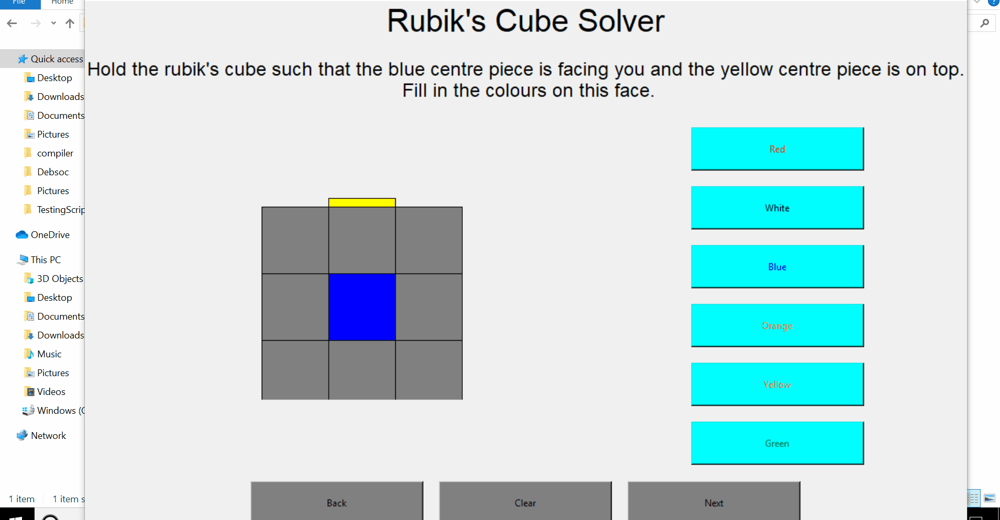
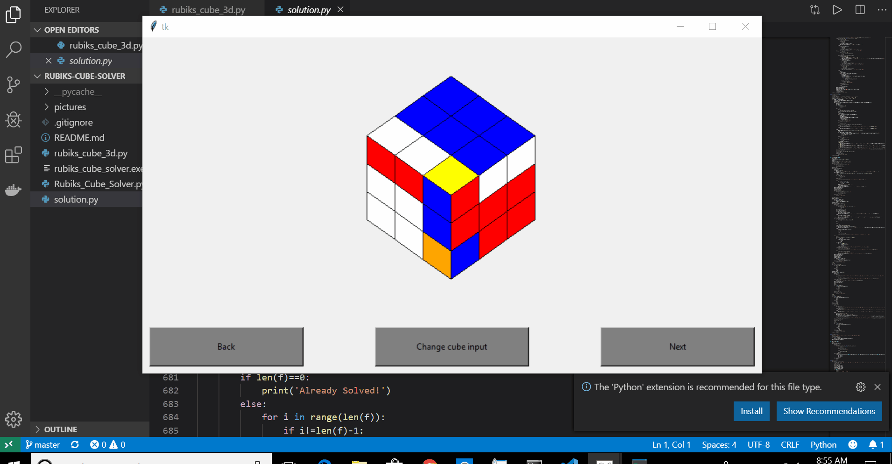

# Rubik's Cube solver

## About the program

A program that can solve any Rubik's Cube using Fredrich CFOP Method.

The back-end was coded without using any APIs or brute force algorithms. The solution algorithm is composed of smaller algorithms each designed to solve a particular step of the Fredrich CFOP method.

The front end is coded using Tkinter. The solution is displayed using a 3D Rubik's cube, that was coded using 3D plane projection and affine transformation equations.

## Demo

You will first need to input the colours of each side of the cube. The GUI looks like this

After inputing each side, the 3D rendering algorithm will give you a manipulable Rubik's cube that solves itself

## Solution

## 3D Rendering

To know more about the 3D rendering algorithm used to achieve this, please click [here](https://github.com/naseer2426/Three-Dimention-Rendering-Tk). It is a library coded for Tk-inter to render 3D polygons.
